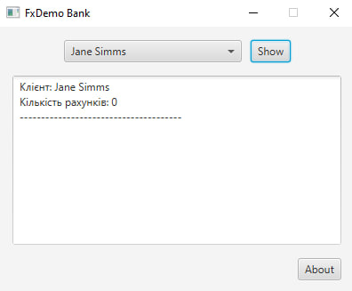

# UI Lab 5

# Практична робота: Розробка графічного інтерфейсу (GUI) за допомогою платформи JavaFX

**Мета роботи:** Ознайомитися з основами побудови сучасних графічних інтерфейсів на базі платформи JavaFX, навчитися керувати життєвим циклом JavaFX-додатка, реалізувати динамічне заповнення компонентів вибору даних із зовнішнього файлу `test.dat` за допомогою класу `DataSource` та налаштувати обробку подій для взаємодії з доменною моделлю банку.

1. У середовищі розробки NetBeans створено новий проєкт із назвою `FxDemo` у пакеті `fxdemo` без генерації стандартного головного класу.
2. Для коректної роботи додатка проєкт було переведено на повну версію платформи BellSoft Liberica Full JDK 21, що містить вбудовані графічні модулі JavaFX.
3. До шляху компіляції проєкту (`Classpath`) підключено зовнішню бібліотеку `MyBank.jar`, яка забезпечує логіку роботи з клієнтами та рахунками додатка.
4. Створено клас `FxDemo.java`, що наслідує `javafx.application.Application`. Графічний інтерфейс вікна побудовано програмно за допомогою контейнерів компонування `BorderPane` та `HBox`.
5. Реалізовано обхід обмежень модульної системи Java шляхом створення додаткового стартового класу `FxMainLauncher` для стабільного запуску вікна.
6. Написано обробники подій для елементів керування JavaFX додатка:
   * При виборі імені зі списку `ComboBox` та натисканні кнопки `Show` програма звертається до методів `Bank` і циклом перебирає всі наявні рахунки клієнта, виводячи їхні баланси в текстову область `TextArea`.
   * При натисканні кнопки `About` викликається інформаційне діалогове вікно `Alert` з даними про розробника.

## Демонстрація роботи програми

